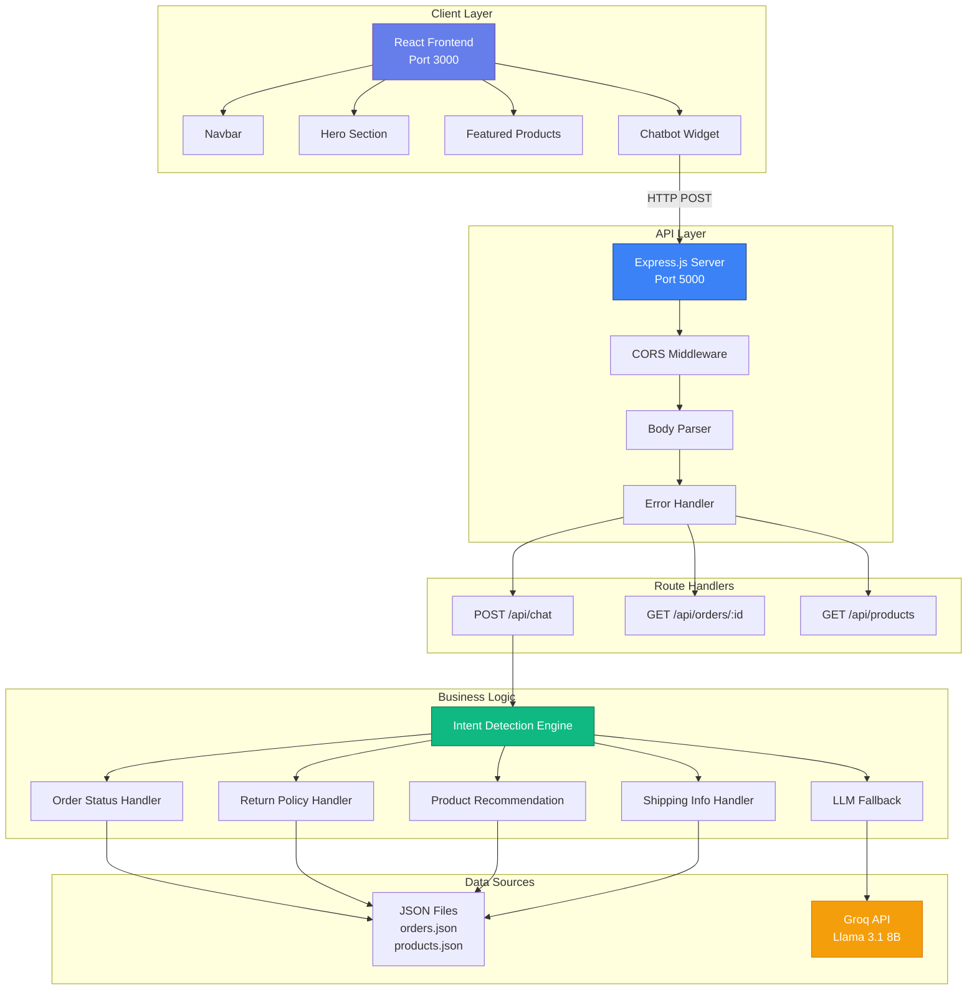
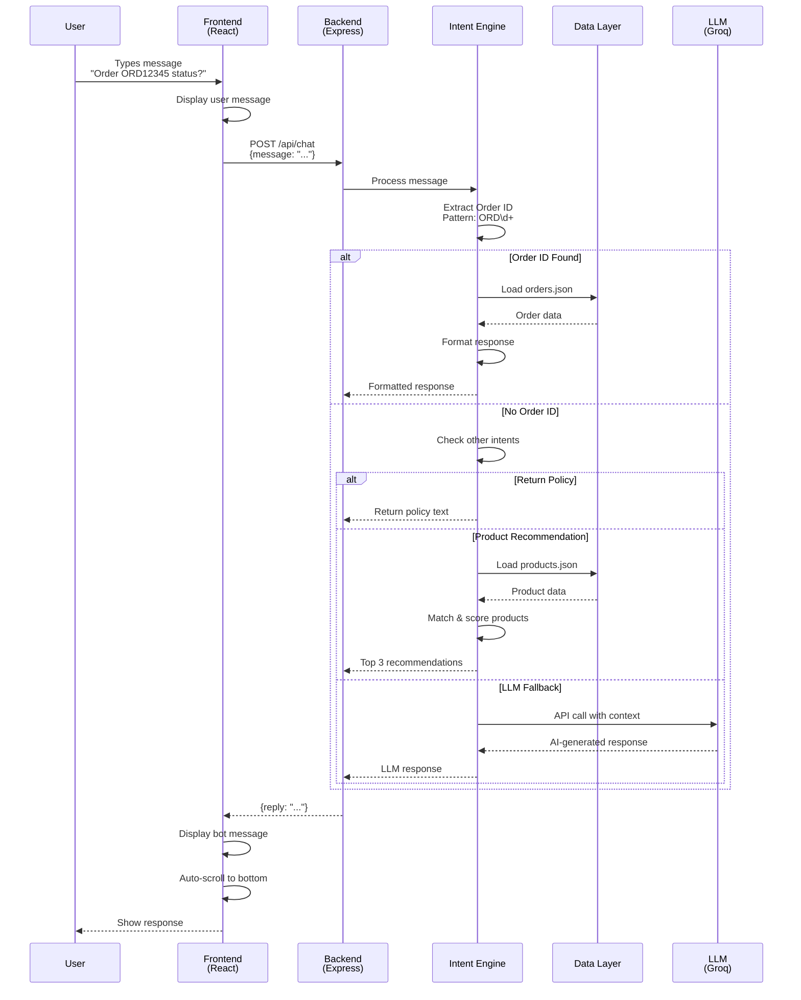
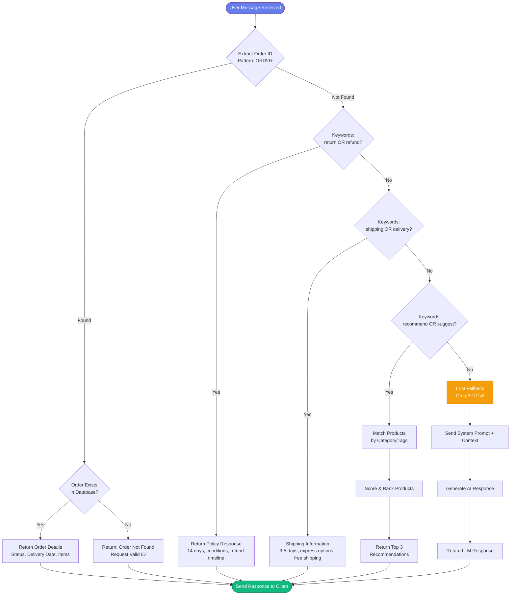
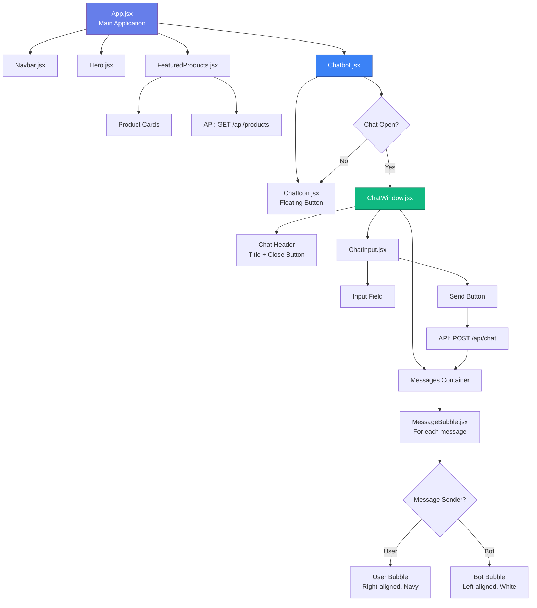
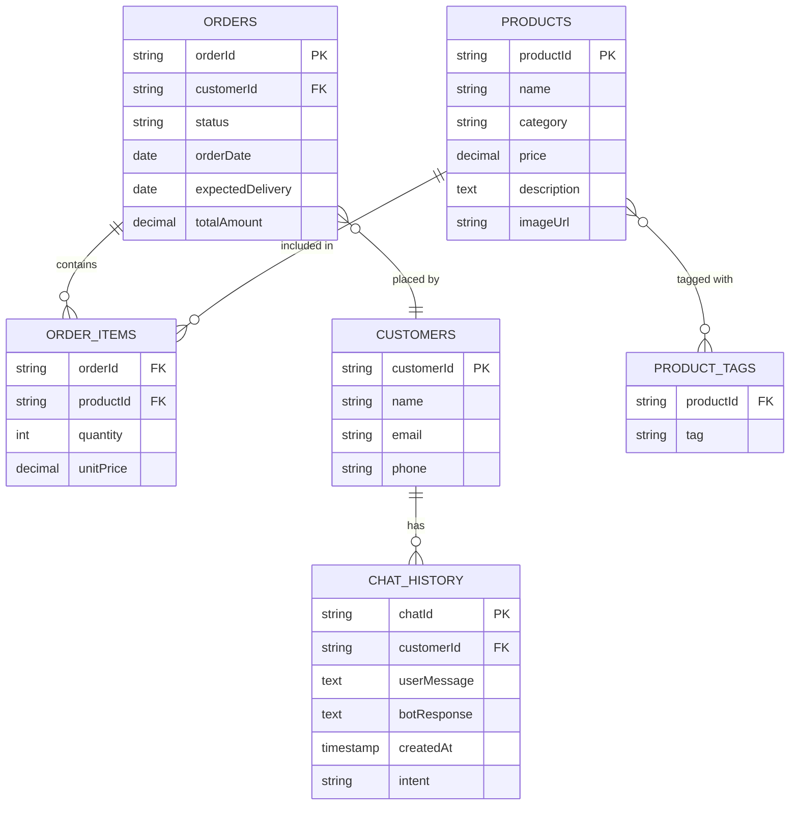
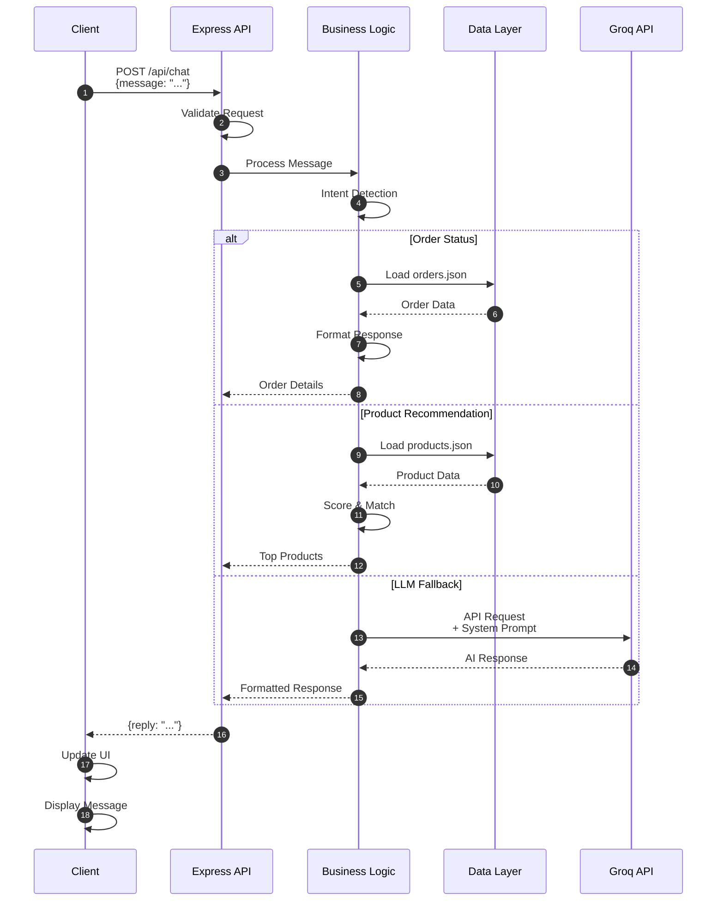
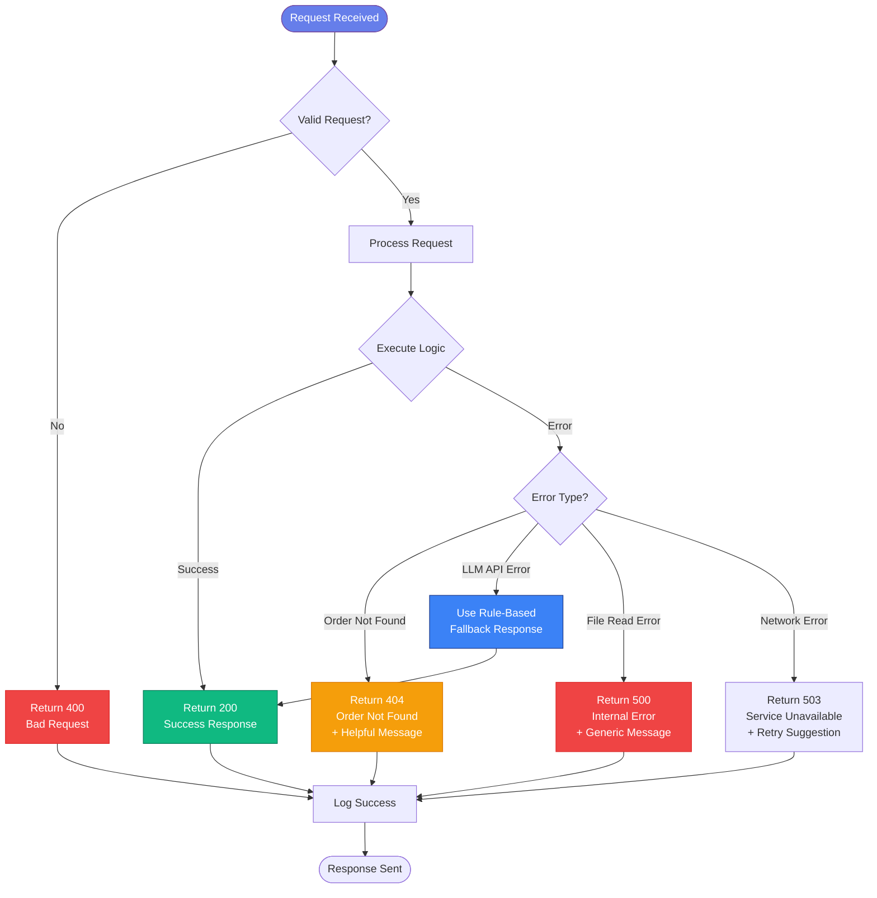
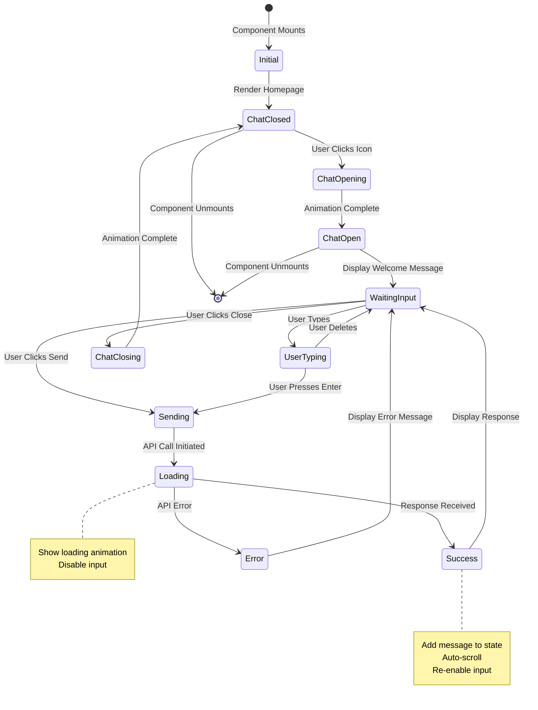

# ShopEase AI Customer Support System - Visual Diagrams

This document contains visual diagrams in Mermaid format that can be rendered in Markdown viewers that support Mermaid (GitHub, GitLab, VS Code with Mermaid extension, etc.).

---

## 1. System Architecture Diagram



---

## 2. Chat Message Flow Diagram



---

## 3. Intent Detection Decision Tree



---

## 4. Frontend Component Hierarchy



---

## 5. Product Recommendation Scoring Algorithm

```mermaid
flowchart LR
    Start([User Query:<br/>'Recommend headphones']) --> Extract[Extract Keywords<br/>['recommend', 'headphones']]
    
    Extract --> Loop[For Each Product<br/>in Database]
    
    Loop --> CheckCategory{Product Category<br/>Matches?}
    CheckCategory -->|Yes| Score1[Score += 5]
    CheckCategory -->|No| CheckTags
    
    Score1 --> CheckTags{Product Tags<br/>Match?}
    
    CheckTags -->|Exact Match| Score2[Score += 3]
    CheckTags -->|Partial Match| Score3[Score += 1]
    CheckTags -->|No Match| NextProduct
    
    Score2 --> NextProduct
    Score3 --> NextProduct
    
    NextProduct{More Products?}
    NextProduct -->|Yes| Loop
    NextProduct -->|No| Sort[Sort by Score<br/>Descending]
    
    Sort --> Top3[Select Top 3<br/>Products]
    Top3 --> Format[Format Response<br/>Name, Price, Category, Tags]
    Format --> Return([Return to User])
    
    style Start fill:#667eea,stroke:#764ba2,color:#fff
    style Return fill:#10b981,stroke:#047857,color:#fff
    style Score1 fill:#f59e0b,stroke:#d97706,color:#fff
    style Score2 fill:#f59e0b,stroke:#d97706,color:#fff
    style Score3 fill:#fbbf24,stroke:#d97706,color:#fff
```

---

## 6. Database Schema (Future Enhancement)



---

## 7. API Request/Response Flow



---

## 8. Deployment Architecture (Future)

```mermaid
graph TB
    subgraph "Client"
        U[Users]
        B[Browser]
    end
    
    subgraph "CDN"
        CDN[CloudFlare/CDN<br/>Static Assets]
    end
    
    subgraph "Frontend Hosting"
        F[Vercel/Netlify<br/>React App]
    end
    
    subgraph "Backend Infrastructure"
        LB[Load Balancer]
        API1[API Server 1]
        API2[API Server 2]
        API3[API Server N]
    end
    
    subgraph "Data Layer"
        DB[(PostgreSQL<br/>Database)]
        Cache[(Redis<br/>Cache)]
    end
    
    subgraph "External Services"
        GROQ[Groq API<br/>LLM Service]
        MONITOR[Monitoring<br/>& Logging]
    end
    
    U --> B
    B --> CDN
    B --> F
    F --> LB
    LB --> API1
    LB --> API2
    LB --> API3
    
    API1 --> DB
    API2 --> DB
    API3 --> DB
    
    API1 --> Cache
    API2 --> Cache
    API3 --> Cache
    
    API1 --> GROQ
    API2 --> GROQ
    API3 --> GROQ
    
    API1 --> MONITOR
    API2 --> MONITOR
    API3 --> MONITOR
    
    style F fill:#667eea,stroke:#764ba2,color:#fff
    style LB fill:#3b82f6,stroke:#1e3a8a,color:#fff
    style DB fill:#10b981,stroke:#047857,color:#fff
    style GROQ fill:#f59e0b,stroke:#d97706,color:#fff
```

---

## 9. Error Handling Flow



---

## 10. State Management Flow (Frontend)



---

## How to View These Diagrams

### Option 1: GitHub/GitLab
These Mermaid diagrams will render automatically when viewing this file on GitHub or GitLab.

### Option 2: VS Code
Install the "Markdown Preview Mermaid Support" extension to view diagrams in VS Code.

### Option 3: Online Tools
1. Copy the Mermaid code block
2. Paste into https://mermaid.live/
3. View and export as image

### Option 4: VS Code Extensions
- "Markdown Preview Mermaid Support"
- "Mermaid Editor"
- "Markdown Preview Enhanced"

---

**End of Diagrams Document**

